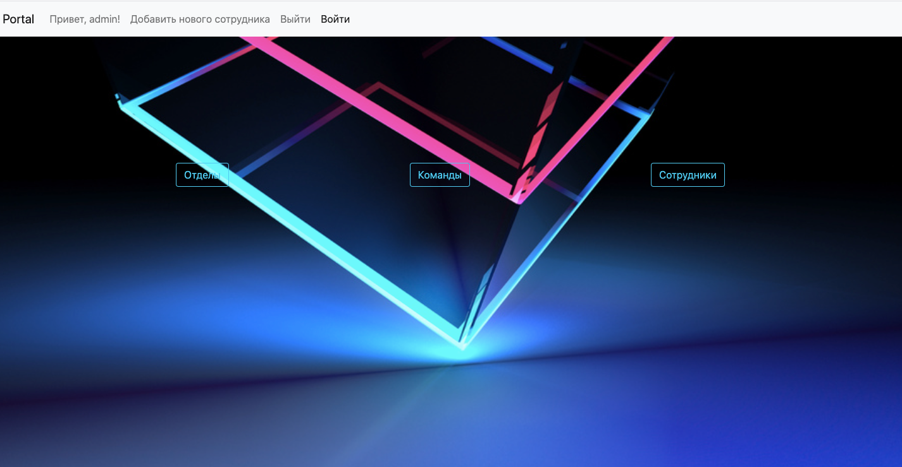
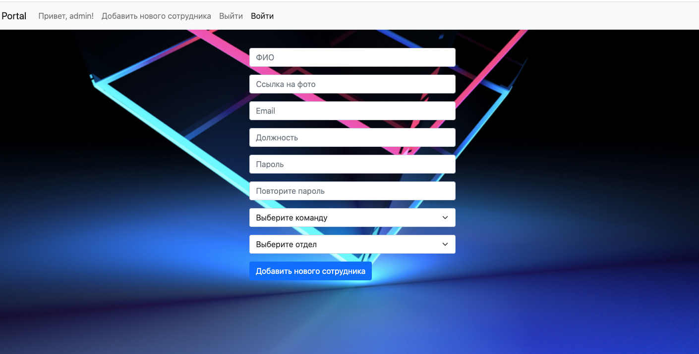
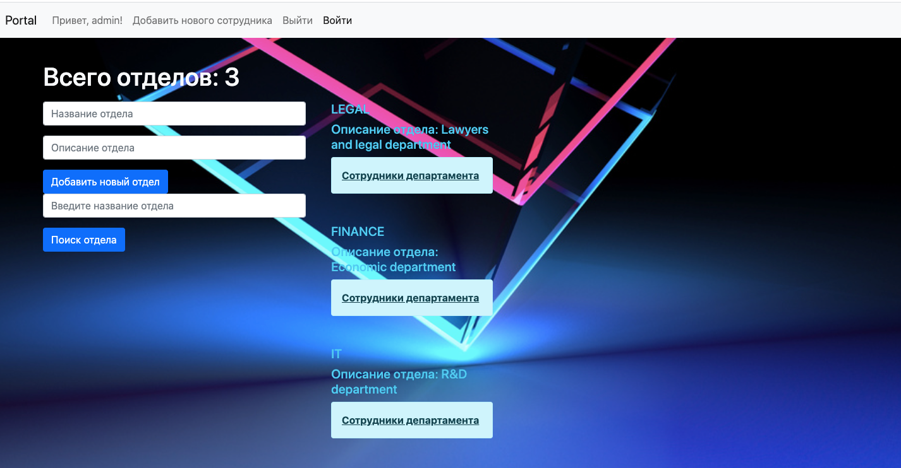
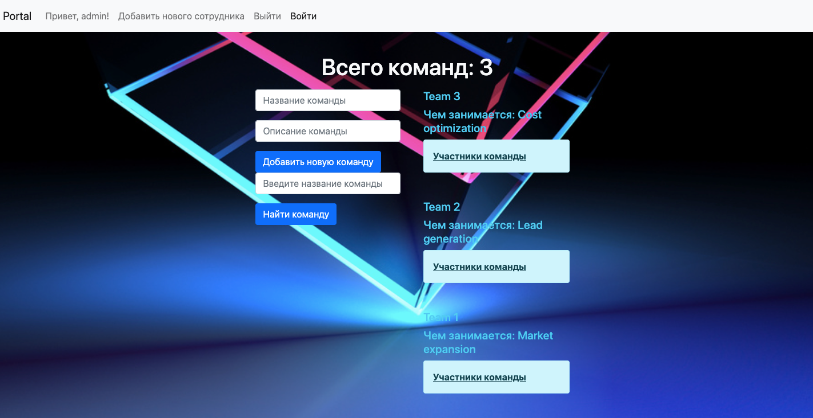

# Internal-portal

Внутренний организационный портал для частной компании.

## Функциональность

Авторизованный доступ на портал только для сотрудников организации. Возможность поиска сотрудников, отделов, команд.
Отображение команд и отделов с описанием, указанием участников и их ролей.

## Установка

Установить пакеты зависимостей

```
npm i
```

Создать и подключить БД под учетной записью Postgres

```

CREATE DATABASE crm;
CREATE USER admin WITH ENCRYPTED PASSWORD '123';
GRANT ALL PRIVILEGES ON DATABASE crm TO admin;
Выполнить миграцию и сид:
npx sequelize db:migrate
npx sequelize db:seed:all

```

## Запуск

В корневой папке проекта выполнить команду

```

npm start

```

---

Перейти на URL http://localhost:3000/ и авторизоваться под учетной записью админа

```
login admin@companyM.com
password 123
```

  
  
  
  
